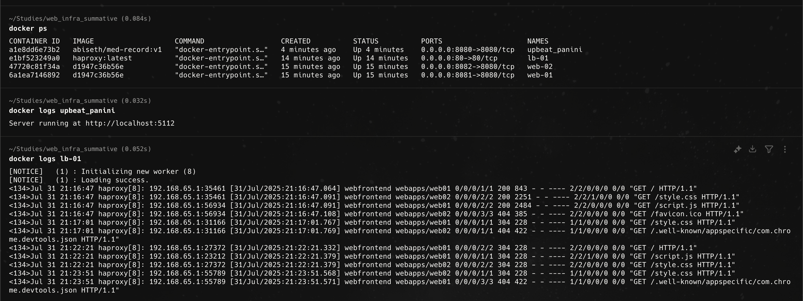
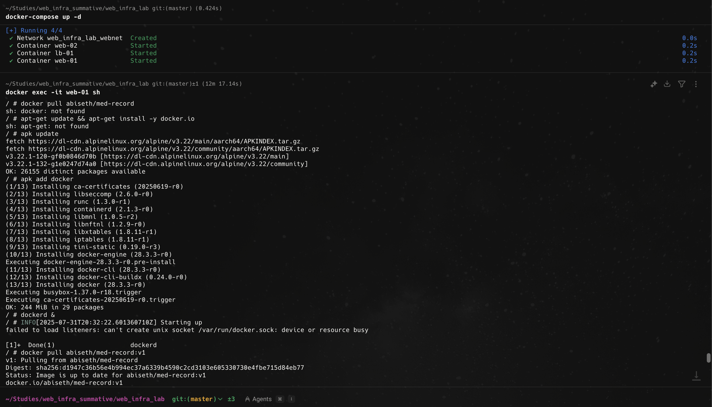

# Playing Around with APIs: Load Balancing with Docker and HAProxy

This project demonstrates a simple web application deployed across multiple containers with load balancing using HAProxy. The app consumes an external API and is hosted on two simulated web servers (`web-01`, `web-02`) behind a load balancer (`lb-01`).

---

## App Idea

The application is a **Drug Information Search Tool** that allows users to search for over-the-counter medications like "ibuprofen" or "acetaminophen" and receive:

* Usage directions
* Dosage instructions
* Warnings
* Drug facts and labeling
* Lists of purposes and other descriptions

It uses the **FDA's Open Drug Label API** to fetch real-time data about medications.

---

## App Structure

* **Frontend**: A simple HTML/JS interface with a search box
* **Backend**: Node.js + Express REST API for querying drug data from the FDA API
* **External API**: [open.fda.gov API](https://open.fda.gov/apis/drug/label/)

---

## API Endpoint

**Route:**
`GET /api/drug?q=<searchTerm>`

**Example:**
`/api/drug?q=ibuprofen`

**Response:**
JSON with structured fields such as:

```json
{
  "brand_name": "Advil",
  "dosage": [
    "do not take more than directed",
    "use smallest dose necessary"
  ],
  "purposes": ["Pain reliever", "Fever reducer"],
  "warnings": ["Reye’s syndrome warning", "Stomach bleeding warning"],
  "directions": [
    "take 1 tablet every 4-6 hours while symptoms persist",
    "do not exceed 6 tablets in 24 hours"
  ]
}
```

---

## Project Structure

```
├── Dockerfile            # Builds the app image
├── web_infra_lab/        # Infrastructure setup (cloned as instructed)
├── backend/              # Abstraction for the querying of the FDA api
├── frontend/             # UI interface for the interaction
```

---

## Demo Video

See `demo.mov` in the repository root for a full walkthrough. Or on youtube [https://youtu.be/VzTj8v6Y4Go](https://youtu.be/VzTj8v6Y4Go)


---

## How to Run Locally

### Step 1 – Clone Infrastructure

```bash
git clone https://github.com/waka-man/web_infra_lab.git
cd web_infra_lab
docker-compose up -d
```

This spins up:

* `web-01` and `web-02` containers
* `lb-01` load balancer container

### Step 2 – Build & Push App Image

From your `/` directory:

```bash
docker build -t abiseth/med-record:v1 .
docker push abiseth/med-record:v1
```

Make sure the app responds differently on each server to test load balancing, e.g., include `"Server: web-01"` in the response.

---

## Deploy to Web Servers

Inside `web-01` and `web-02`:

```bash
docker exec -it web-01 sh
docker pull abiseth/med-record:v1
docker run -d --name app -p 8080:8080 abiseth/med-record:v1
exit
```

Repeat for `web-02`.

---

## Configure HAProxy in lb-01

```bash
docker exec -it lb-01 sh
vi /etc/haproxy/haproxy.cfg
```

Insert this config:

```
global
    daemon
    log stdout local0

defaults
    mode http
    timeout connect 5000ms
    timeout client 50000ms
    timeout server 50000ms
    log global
    option httplog

frontend webfrontend
    bind *:80
    default_backend webapps

backend webapps
    balance roundrobin
    option httpchk GET /
    server web01 web-01:8080 check
    server web02 web-02:8080 check
```

Then reload:

```bash
haproxy -f /etc/haproxy/haproxy.cfg -c
haproxy -sf $(pidof haproxy) -f /etc/haproxy/haproxy.cfg
```

---

## Test Load Balancing with a batch of requests

```bash
for i in {1..6}; do curl http://localhost:80; sleep 1; done
```

Expect responses alternating between `web01` and `web02`.

---

## Evidence to Capture

* Show running containers (`docker ps`)
* Test load balancing with multiple `curl` calls
* Show HAProxy config
* Frontend UI and performed searches
* Confirmed correct behavior in both `web-01` and `web-02`






---

## Final Checklist

* [x] App and external API work correctly
* [x] App is deployed on both web servers
* [x] Load balancing is configured and tested
* [x] Demo video (`demo.mov`) included in repo
* [x] Docker Hub image pushed and pulled successfully

---

## External API Reference

* FDA Drug Labeling API:
  [https://open.fda.gov/apis/drug/label/](https://open.fda.gov/apis/drug/label/)

---

## Docker Hub

* [https://hub.docker.com/repository/docker/abiseth/med-record](https://hub.docker.com/r/abiseth/med-record/tags)

## Youtube Link

* [https://youtu.be/VzTj8v6Y4Go](https://youtu.be/VzTj8v6Y4Go)


